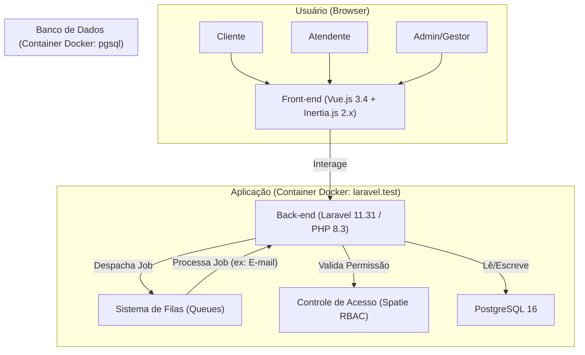

<div align="center">

# AquaShift: Motor de Agendamento Inteligente para Lava-Jatos 🚘💦


> 🟡 **Status:** projeto em evolução contínua, focado em mostrar domínio de Laravel + Vue + Inertia + Docker + PostgreSQL, num caso de uso real (lava-jato / estética automotiva).

</div>

---

## 📚 Sumário

1.  [Visão Geral](#-visão-geral)
2.  [Por que esse projeto existe?](#-por-que-esse-projeto-existe)
3.  [Funcionalidades Chave (Planejadas)](#-funcionalidades-chave-planejadas)
4.  [Objetivos Técnicos](#-objetivos-técnicos)
5.  [Arquitetura do Sistema](#-arquitetura-do-sistema)
6.  [Stack Tecnológica](#-stack-tecnológica)
7.  [Stack Tecnológica Detalhada](#-stack-tecnológica-detalhada)
8.  [Roadmap do Projeto](#-roadmap-do-projeto)
9.  [Guia de Instalação e Execução](#-guia-de-instalação-e-execução)
10. [Solução de Problemas (Troubleshooting)](#-solução-de-problemas-troubleshooting)
11. [ Diário de Comandos (Didático)](#-diário-de-comandos-didático)
12. [Contribuição](#-contribuição)
13. [Autoria](#-autoria)

---

## 🪐 Visão Geral

**AquaShift** é uma aplicação web (SaaS-ready) projetada para otimizar a gestão de agendamentos em **lava-jatos** e **estúdios de estética automotiva**.  
O sistema não é apenas um calendário: ele foi pensado como um **motor de otimização com restrições de recursos**, capaz de alocar horários de forma inteligente, maximizando a produtividade dos boxes e da equipe.

> 💡 *Imagine um sistema que entende a rotina do negócio e sugere automaticamente o melhor horário, evitando sobrecarga, ociosidade e aumentando o faturamento.*

---

## 🎯 Por que esse projeto existe?

O **AquaShift** nasceu como um projeto pessoal de estudo e prática profissional, com o objetivo de **simular o ambiente real de uma aplicação SaaS moderna**, mas também de **me desafiar a ir além do CRUD tradicional**.  
Mais do que um sistema de agendamento para lava-jatos, ele é um **laboratório de experimentação full-stack**, onde aplico e documento todo o processo, da arquitetura à entrega.

### 🧱 1. Reproduzir um ambiente de produção completo
Quis construir o projeto **exatamente como uma empresa faria em produção**, utilizando ferramentas e práticas de mercado:  
**Docker, Laravel Sail e WSL2**.  
Com isso, aprendi a lidar com containers, redes internas, volumes, variáveis de ambiente e integração entre serviços (PHP, PostgreSQL, Node).  
Esse fluxo me ajuda a dominar **deploys consistentes e portáveis**, além de entender o impacto real de performance e configuração em um stack realista.

### ⚙️ 2. Aprender e validar a “Arquitetura Monolítica Moderna”
Escolhi **Laravel + Vue + Inertia.js** por acreditar que essa combinação traz o melhor dos dois mundos:  
um back-end poderoso e seguro, com um front-end reativo e fluido, sem a complexidade de uma API separada.  
O projeto é uma **SPA (Single Page Application)** com renderização híbrida e comportamento dinâmico, ideal para demonstrar proficiência em **integração entre camadas** e otimização de fluxo entre back e front.

### 🧩 3. Resolver problemas de lógica de negócio reais
O motor central do AquaShift não é só um agendador.  
É uma **engine de otimização de recursos**, que precisa lidar com **restrições, concorrência, no-shows, encaixes e atrasos**, além de distribuir horários conforme disponibilidade de boxes e serviços.  
Aqui, pratico **modelagem de estados complexos e raciocínio algorítmico**, simulando desafios de sistemas reais, como agendamento hospitalar, logística ou operações.

### 🚀 4. Consolidar uma base sólida de boas práticas
Além da parte técnica, o projeto também representa minha busca por **organização e padrão profissional**.  
Uso migrations e seeders para versionar o banco, **Spatie Permission** para controle de acesso granular (RBAC), e sigo um fluxo de desenvolvimento controlado por containers e scripts automatizados (Sail, npm, artisan).  
Cada commit e etapa são pensados para reforçar o aprendizado e formar uma base que possa escalar para futuros projetos comerciais.

> 💡 Em resumo: o AquaShift é o meu “campo de testes profissional”, onde pratico o que aprendo, documento o processo e provo, a mim mesma, que consigo transformar uma ideia em um sistema robusto, modular e preparado para o mundo real.

[⬆️ Voltar ao sumário](#-sumário)

---

## ⚙️ Funcionalidades Chave (Planejadas)

- **Motor de Agendamento Inteligente:** otimização de slots baseada em disponibilidade de boxes, tipo de serviço e duração.
- **Alocação Dinâmica:** capacidade de reordenar filas para lidar com atrasos, *no-shows* e encaixes.
- **Upselling Inteligente:** sugestão de serviços adicionais (ex: "Encerar +10min") com ajuste automático do tempo de alocação.
- **Arquitetura Multi-Filial (SaaS-ready):** suporte nativo para múltiplas filiais com gerenciamento centralizado.
- **Controle de Acesso (RBAC):** níveis de permissão granulares (Admin, Gestor, Atendente, Cliente).
- **Jornada do Usuário Moderna:** interface PWA (Progressive Web App), modo Quiosque (Recepção) e QR Check-in.
- **Sistema de Notificações:** jobs em fila (Queues) para lembretes por e-mail/WhatsApp.

[⬆️ Voltar ao sumário](#-sumário)

---

## 💡 Objetivos Técnicos

Este projeto implementa e demonstra competência em pilares essenciais do desenvolvimento Full-Stack moderno:

1. **Lógica de Negócio Complexa:** implementação de um algoritmo de otimização de agenda, tratando concorrência, restrições e alocação de recursos.
2. **Ambiente de Desenvolvimento Padrão de Indústria:** uso exclusivo de **Docker (via Laravel Sail)** sobre **WSL2**, garantindo um ambiente de desenvolvimento 100% portátil, isolado e consistente.
3. **Arquitetura Full-Stack Moderna:** construção de uma Single Page Application (SPA) reativa com **Vue.js 3.4** sem a sobrecarga de uma API REST/GraphQL, utilizando **Inertia.js 2.x** como ponte monolítica moderna.
4. **Boas Práticas e Escalabilidade:** implementação de uma arquitetura MVC limpa, autorização granular (RBAC com `spatie/laravel-permission`), e uso de Seeders/Migrations para garantir a integridade e manutenção da base de dados.

[⬆️ Voltar ao sumário](#-sumário)

---

## 🏛️ Arquitetura do Sistema

A aplicação opera 100% em containers Docker orquestrados pelo Laravel Sail. O front-end (Vue.js) não é desacoplado; ele é renderizado pelo back-end (Laravel) via Inertia.js, combinando a reatividade de uma SPA com a produtividade de um monólito.



[⬆️ Voltar ao sumário](#-sumário)

---

## 🛠️ Stack Tecnológica

<div align="center">

|           Tecnologia           |                                                           Logo                                                          | Descrição                             |
| :----------------------------: | :---------------------------------------------------------------------------------------------------------------------: | :------------------------------------ |
|        **Laravel 11.31**       |          | Backend robusto, API-less com Inertia |
|         **Vue.js 3.4**         |                     | Front-end reativo (Composition API)   |
|       **Inertia.js 2.x**       |      | Ponte Laravel ↔ Vue sem REST          |
|      **TailwindCSS 3.2.1**     |  | Estilização ágil e moderna            |
|        **PostgreSQL 16**       |           | Banco relacional com JSONB            |
|         **Vite 6.0.11**        |                                                                     | Build super-rápido                    |
|    **Docker + Sail (1.47)**    |                   | Ambiente isolado e reproduzível       |
| **Spatie (RBAC, Media, Logs)** |                                                            🧩                                                           | Permissões, auditoria e mídia         |
|          **Ziggy 2.x**         |                                                            🧭                                                           | Rotas do Laravel disponíveis no front |

</div>

[⬆️ Voltar ao sumário](#-sumário)

---

## 🛠️ Stack Tecnológica Detalhada

### Ambiente de Desenvolvimento

* **Containerização:** Docker
* **Orquestração:** Laravel Sail (`^1.47`)
* **SO Host (recomendado):** Windows 10/11 + WSL2 (Ubuntu)

### Back-end

* **PHP:** ^8.3
* **Laravel:** 11.31
* **Pacotes principais:**

  * `inertiajs/inertia-laravel:^2.0`
  * `spatie/laravel-permission:*`
  * `tightenco/ziggy:^2.0`
  * `laravel/sanctum:^4.0`
* **Banco:** PostgreSQL 16 (tipos `JSONB`)
* **Autenticação:** Laravel Breeze `^2.3`
* **Filas/Jobs:** driver `database` (pronto para Redis)

### Front-end

* **Vue:** ^3.4.0
* **@inertiajs/vue3:** ^2.0.0
* **Vite:** ^6.0.11
* **@vitejs/plugin-vue:** ^5.0.0
* **TailwindCSS:** ^3.2.1
* **Axios:** ^1.7.4
* **Laravel Vite Plugin:** ^1.2.0
* **Concurrently:** ^9.0.1 (para rodar vários processos em dev)

[⬆️ Voltar ao sumário](#-sumário)

---

## 🗺️ Roadmap do Projeto

* [x] **Fase 0: Ambiente (Setup Profissional)**

  * [x] Configuração do Windows com WSL2 e Docker Desktop.
  * [x] Instalação do Laravel Sail com container `pgsql`.
  * [x] Resolução de problemas de rede (WSL/Windows) e performance (Composer).
* [x] **Fase 1: Fundação (Core)**

  * [x] Instalação e configuração do Laravel Breeze (Vue + Inertia).
* [x] **Fase 2: Modelagem do Núcleo**

  * [x] Criação das migrações do núcleo (`services`, `branches`, `bays`, `bookings`).
  * [x] Configuração da conexão de cliente de banco (DBeaver) via IP do WSL2.
* [x] **Fase 3: Acesso e Lógica**

  * [x] Definição dos relacionamentos Eloquent (Models).
  * [x] Instalação e configuração do `spatie/laravel-permission`.
  * [x] Criação do Seeder de Papéis e Permissões.
* [x] **Fase 4: Painel Admin**

  * [x] CRUD de Filiais (Branches) e Boxes (Bays).
  * [x] CRUD de Serviços (Services).
  * [x] CRUD de Usuários e atribuição de papéis.
* [ ] **Fase 5: O Motor (Core Logic) (Em Andamento)**

  * [ ] Implementar o serviço de "disponibilidade" (verificação de slots).
  * [ ] Criar a lógica de agendamento (o "motor de otimização").
* [ ] **Fase 6: Front-end do Cliente**

  * [ ] Construir o fluxo de agendamento em Vue.js.
  * [ ] Criar o painel "Meus Agendamentos".

[⬆️ Voltar ao sumário](#-sumário)

---

## 🚀 Guia de Instalação e Execução

Este projeto é 100% containerizado. Siga os passos no ambiente recomendado (Windows/WSL2) para uma instalação sem erros.

### Pré-requisitos (Obrigatórios)

1.  **Git:** [Instale o Git](https://www.google.com/search?q=https://git-scm.com/downloads) para clonar o repositório.
2.  **WSL2 (Subsistema Windows para Linux):**
      * Siga o [guia oficial da Microsoft](https://learn.microsoft.com/pt-br/windows/wsl/install) para instalar.
      * Após a instalação, instale uma distribuição (ex: **Ubuntu**) pela Microsoft Store.
3.  **Docker Desktop for Windows:**
      * Baixe e instale [pelo site oficial](https://www.docker.com/products/docker-desktop/).
      * Durante a instalação, garanta que a opção "Use WSL 2 instead of Hyper-V" esteja **marcada**.

> **Nota Importante:** Você **não** precisa instalar PHP, Node.js, Composer ou PostgreSQL na sua máquina Windows. O Laravel Sail gerencia 100% dessas dependências dentro dos containers Docker.

### Passo 0: Configuração Crítica do Docker

Antes de começar, garanta que seu Docker Desktop está integrado ao WSL2:

1.  Abra o Docker Desktop.
2.  Vá em **Settings \> Resources \> WSL Integration**.
3.  Certifique-se de que a opção "Enable integration with my additional distros" esteja **ATIVADA** para a sua distribuição (ex: "Ubuntu").

### Passo 1: Terminal e Clonagem

> ❗**NÃO USE o Git Bash, CMD ou PowerShell.** Todos os comandos a seguir devem ser executados de dentro do seu **Terminal Ubuntu (WSL2)**.

1.  Abra o terminal **Ubuntu** (pelo Menu Iniciar).

2.  Navegue até o diretório onde você armazena seus projetos no Windows (ex: `C:\Dev` vira `/mnt/c/Dev/`):

    ```bash
    # Exemplo de navegação
    cd /mnt/c/Dev/

    # Clonar o repositório
    git clone [https://github.com/seu-usuario/aquashift.git](https://github.com/seu-usuario/aquashift.git)
    cd aquashift
    ```

### Passo 2: Configurar o `.env`

O Sail precisa do arquivo `.env` para configurar os containers.

```bash
# Copia o arquivo de exemplo
cp .env.example .env
```

Abra o projeto no VSCode (no terminal, digite `code .`) e **verifique** seu arquivo `.env`. O `DB_HOST` deve ser o nome do serviço do Docker, não `localhost`.

Garanta que seu bloco `DB_` esteja assim:

```dotenv
DB_CONNECTION=pgsql
DB_HOST=pgsql
DB_PORT=5432
DB_DATABASE=aquashift_db
DB_USERNAME=sail
DB_PASSWORD=password
```

### Passo 3: Instalação e Execução (Sail)

Vamos instalar as dependências do Composer (usando um container temporário) e depois subir o ambiente.

```bash
# Cria o atalho "sail" (só precisa uma vez)
echo "alias sail='./vendor/bin/sail'" >> ~/.bashrc
source ~/.bashrc

# 1. Instala as dependências do Composer (PHP)
# (Usamos um container 'docker run' para a primeira instalação)
docker run --rm \
    -u "$(id -u):$(id -g)" \
    -v "$(pwd):/var/www/html" \
    -w /var/www/html \
    laravelsail/php83-composer:latest \
    composer install --ignore-platform-reqs

# 2. Sobe os containers (PHP, PostgreSQL) em segundo plano
# (Isso vai baixar as imagens e pode demorar 10-15 min na primeira vez)
sail up -d
```

### Passo 4: Finalização do Setup

Com os containers no ar, vamos finalizar a instalação do app.

```bash
# 1. Gere a chave do App
sail artisan key:generate

# 2. Instale as dependências do Front-end (Node.js)
sail npm install

# 3. Rode as migrações (cria as tabelas) e os seeders (cria os papéis)
sail artisan migrate:fresh --seed

# 4. Compile os assets do front-end
sail npm run dev
```

### Passo 5: Acesso ao Sistema

A aplicação está 100% operacional.

  * **URL da Aplicação:** [http://localhost](https://www.google.com/search?q=http://localhost)
  * **Monitor de E-mails (Mailpit):** [http://localhost:8025](https://www.google.com/search?q=http://localhost:8025)

[⬆️ Voltar ao sumário](#-sumário)

---

## ⚠️ Solução de Problemas (Troubleshooting)

Esta seção documenta problemas comuns encontrados durante o setup no ambiente Windows/WSL2.

#### 1\. Erro: `exceeded the timeout of 300 seconds` (Composer)

  * **Contexto:** Ao rodar `sail composer require ...` ou `sail composer update`.
  * **Causa:** A comunicação de I/O de arquivos entre o WSL2 (Linux) e o `vendor/` (Windows) é lenta, fazendo o Composer "desistir".
  * **Solução:** Diga ao Composer para ter um tempo limite ilimitado:
    ```bash
    sail composer config --global process-timeout 0
    # E então tente o comando 'update' ou 'require' novamente
    sail composer update
    ```

#### 2\. Erro: `FATAL: password authentication failed` (DBeaver / DataGrip)

  * **Contexto:** Ao tentar conectar um cliente de banco de dados (DBeaver, DataGrip) rodando no Windows ao banco de dados do container.
  * **Causa:** A "ponte" de rede entre o `localhost` do Windows e o `localhost` do WSL2/Docker falha. O cliente não encontra o container na porta `5432`.
  * **Solução:** Não use `localhost`. Conecte-se usando o IP real da sua máquina WSL2:
    1.  No seu **terminal Ubuntu (WSL2)**, encontre seu IP:
        ```bash
        ip addr show eth0 | grep "inet " | awk '{print $2}' | cut -d/ -f1
        ```
    2.  Ele retornará um IP (ex: `172.20.10.11`).
    3.  Use **esse IP** no campo "Host" do seu cliente de banco de dados.
    4.  As credenciais são as do seu `.env` (`aquashift_db`, `sail`, `password`).

#### 3\. Erro: `bash: ./sail: No such file or directory`

  * **Causa:** Você está tentando rodar o comando `sail` de um terminal Windows (CMD, PowerShell ou Git Bash). O Sail foi projetado para rodar em ambientes Linux.
  * **Solução:** **Feche** esse terminal. Use **apenas** o terminal do **Ubuntu (WSL2)**, que você pode abrir pelo Menu Iniciar do Windows.

#### 4. Erro: `ERESOLVE unable to resolve dependency tree` (NPM / Vite)

* **Contexto:** Ao rodar `sail npm install` pela primeira vez, caso o `package.json` esteja desatualizado.
* **Causa:** O instalador do Laravel Breeze (`breeze:install`) pode, em alguns momentos, gerar um `package.json` com versões de pacotes que parecem conflitantes.
* **Solução:** O arquivo `package.json` neste repositório **já está validado** e alinhado. Se, por algum motivo, você enfrentar este erro após uma atualização, garanta que as versões do `vite` e `@vitejs/plugin-vue` estejam compatíveis. As versões funcionais usadas neste projeto são:
    ```json
    "devDependencies": {
        ...
        "@vitejs/plugin-vue": "^5.0.0",
        ...
        "vite": "^6.0.11",
        ...
    }
    ```

[⬆️ Voltar ao sumário](#-sumário)

---

## 📓 Diário de Comandos (Didático)

Para fins didáticos e para documentar o processo completo de setup, depuração de ambiente e desenvolvimento, um log completo de todos os comandos de terminal usados neste projeto (desde a instalação do WSL2 até os comandos do artisan) está disponível em um arquivo separado.

Este documento é ideal para quem deseja replicar o ambiente ou entender a fundo o fluxo de trabalho:

➡️ **[`COMMAND_LOG.md`](./COMMAND_LOG.md)**

---

## 🪞 **Contribuição**

Contribuições são bem-vindas!
Siga as boas práticas do repositório, mantendo **commits semânticos** e **pull requests limpos**.

```bash
feat: adiciona engine de otimização
fix: corrige conflito de horários duplicados
```

[⬆️ Voltar ao sumário](#-sumário)

---

## 👩‍🎓 Autoria


> Desenvolvido com 💛 por **Angel Luz**.

Se quiser conversar, colaborar ou oferecer uma oportunidade:

📬 E-mail: [contatoangelluz@gmail.com](mailto:contatoangelluz@gmail.com)  
🐙 GitHub: [@angelluzk](https://github.com/angelluzk)  
💼 LinkedIn: [linkedin.com/in/angelitaluz](https://www.linkedin.com/in/angelitaluz/)  
🗂️Website / Portfólio: [meu_portfolio/](https://angelluzk.github.io/meu_portfolio/) 

-----

<div align="center">

> “Transformando código em fluxo, e ideias em movimento.”

</div>